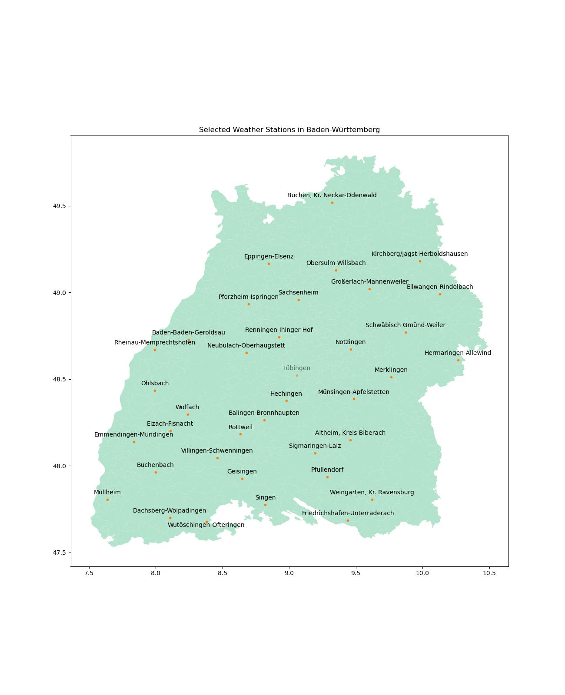
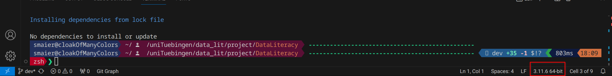
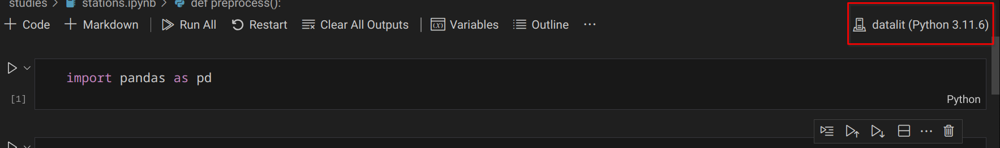

# DataLiteracy

This repository contains the tools and pipeline for data analysis to investigate the performance of weather-forecasts the German-Weather-Agency ([DWD](https://www.dwd.de/DE/Home/home_node.html)) is providing. 
We collected forecasts from 36 stations across the state of Baden-Württemberg from the begging of December until the end of January. 

The project contains 3 main building blocks.

1. A dockerized download server to download the forcasts from the [open weather api](https://dwd.api.bund.dev/)
2. Studies we conducted on the data formulated in [Jupyter Notebooks](https://jupyter.org/)
3. A summarizing report over the work we conducted. 

The following chapters provide a brief overview how to use the codebase. 

## Installation

We use [poetry](https://python-poetry.org/) for package management in Python. If you didn't already installed it you can read up on it [here](https://python-poetry.org/docs/#installation).   
To install the dependencies execute in project root:
```bash
poetry install
```

For further insights into poetry we cna recommend their [documentation](https://python-poetry.org/docs/).

## Download Server

To start the download server you have to install docker. After this call
```bash
docker-compose -f docker/docker-compose.yaml up -d
```
to start the download server. This server will call the DWD API once per day at 00:10 with the specified `station_ids` in the [config file](project/config/crawler.config.yaml) and writes its results in `data/dwd/raw` as json files. The filename is the integer of the timestamp the api was called at.

Note for Developers:  
If you would like to extend this service also to other API feel free to implement your own crawler and add them to the CrawlerManager. 

## Prepare Data

We provide collected forecast data on Git LFS. Therefore you should already have downloaded a bunch of json files from Git-LFS. Nevertheless you also need to do following steps in order to start the analysis.

1. **Download historical data**: To asses the quality of a forecast model you have to download the historical data. Because this research project was conducted in Germany we use the historical and recent data from the DWD. To download each dataset respectively execute in project root:
    ```bash
    python -m project get-recent --station-ids 257 4189 13965 755 757 5688 1197 1214 1224 1255 1239 6258 1584 6259 2074 7331 2575 2814 259 3402 5562 6275 3734 1602 3925 3927 4160 4169 4300 4349 6262 4703 6263 5229 4094 5664 5731 --save-path data/dwd/recent/ --features precipitation  air_temperature
    ```
    This will download the recent data (form the last 6 months) into `data/dwd/recent`.  
    If your forecast data is older than 6 months you have to execute the same command but instead of using `get-recent` type `get-historical` (Note: Not tested yet).
2. **Covert Json to CSV**: Our analysis script are based on a `DWDDataset` object which is based on csv files. Therefore you have to convert the forecast data form json format to csv format. To do so please execute:
    ```bash
    python -m project convert-to-csv --input data/dwd/raw --output data/dwd/csv
    ```
    This command will scrape the forecast data and convert it into individual csv files at the specified output directory.

## Do Analysis

As mentioned before our analysis is based on calculations done in Jupyter-Notebooks. To start every Notebook incorporated in the final report please start the analysis with.
```bash
python -m project analyse
```

## Further Tooling

To get more insigth what code base is capable of have a look at all commands with
```bash
python -m project --help
```
and into the individual commands with:
```bash
python -m <command> --help
```

## Code base

The codebase is structured as follows:
```bash
├── data            # data folder
├── docker          # contains compose and Dockerfile
├── docs            # contains code documentation and report files
├── figures         # figures for Readme.md
├── LICENSE       
├── poetry.lock     # poetry lock file
├── project         # main code base
├── pyproject.toml  # poetry project file
├── README.md       
└── studies         # Notebooks, Python code, tooling, ...:  associated with the analysis
```

The content of `project`: 
```bash
.
├── analysis        # Classes to start analysis pipeline
├── config          # config files for analysis and download server
├── convert         # converter to convert api data into csv
├── crawler         # api crawler and crawler manager
├── database        # Not used yet: Tooling to build and load data into and SQL DB
├── __init__.py
├── __main__.py     
├── process         # main process class. Backbone of __main__.py
└── utils           # general tooling used by all components: interaction to filesystem, ...
```

## Data

as previously meantioned we collected forecast data from 36 station accross the state of Baden-Württemberg. 


The forecast we received from the `StationOverview` interface is documented at: https://dwd.api.bund.dev/.  
Note: If you try it you self you will experience precipitation and temperature forecast as integers. To successfully use them in comparison to the historical or recent data you have to divide at least those values by 10.  

We highly encourage all readers to conduct their own experiments on the collected data but also verify our results.  
If you have any doubts please add an issue at the corresponding GitHub repository. We will get back to you as soon as possible.

In case you build upon our repository or parts of the codebase we kindly ask to mention us in your work and refer to the original authors of this repository. 

## Acknowledgments

At this point we would like to thank the DWD to provide detailed public weather data but also Prof. Philip Hennig for providing great advice in his lectures and the opportunity to do this Data-Science project.

## Authors

[Leonor Diederichs](https://github.com/lilli288)  
[Samuel Maier](https://github.com/9SMTM6)  
[Mathias Neitzel](https://github.com/mathicantcode)  
[Robin Uhrich](https://github.com/RobinU434)  


## Code Base

Note that you have manually create the database WeatherData in the mariadb docker

## Installation

We use `poetry` for package dependencies.
Poetry is (used here) in general similar to other project based package managers, eg. `npm`.

### Why poetry

The advantages of this approach over the approach of eg. raw `pip` with a `requirements.txt` is that it should be more repeatable:

* it keeps the precise package versions installed in a separate `poetry.lock` file and uses these versions, so version mismatch should be minimal
* it isolates you from the system packages (poetry creates a python `virtual environment` under the hood)
* this extends to many extra tools such as `jupyter`

### Installing `poetry`

Honestly they kind of messed up installation instructions since the last time I checked.

I simply use the system package on my system, however that version will be quite old for ubuntu (i checked with a docker image, it seems to be >2 years old at this point), which is the default WSL distribution.

Since `poetry` isnt that old to begin with I suspect that using such old a version isnt helpful.

So instead I suggest installing using the [official script](https://python-poetry.org/docs/#installing-with-the-official-installer).
[Wayback machine snapshot](https://web.archive.org/web/20231219164822/https://python-poetry.org/docs/#installing-with-the-official-installer) for reference, you can **ignore** the red warning, other than it states the guide is up to date, and you **ONLY** need to do the first step.

You should have `poetry` available as commandline argument afterwards (with a similar version):

```sh
> poetry --version
Poetry (version 1.7.1)
```

### Using `poetry`

With an installation of `poetry` you really only need to execute a single command in the project root (where the `pyproject.toml` is located):

```
poetry install
```

This will install all dependencies (with precisely the versions in the `poetry.lock` file, which is regenerated every time the dependencies are changed) into a virtual environment.

#### Using poetry with plain python files and VSCode

When using VSCode (with the Python and Jupyter extensions) and with a simple python file, this virtual environment can simply be selected by selecting the python version in the lower right corner while a python file is opened:



The virtual environment was automatically discovered for me, its recognizable by the (lowercase) name of the parent folder. Should this not work, with `poetry env info` you can see where the executable is located:

```sh
> poetry env info

Virtualenv
Python:         3.11.6
Implementation: CPython
Path:           /home/<user>/.cache/pypoetry/virtualenvs/dataliteracy-<id>-py3.11
Executable:     /home/<user>/.cache/pypoetry/virtualenvs/dataliteracy-<id>-py3.11/bin/python # <-- this is the path to select.
Valid:          True

System
Platform:   linux
OS:         posix
Python:     3.11.6
Path:       /usr
Executable: /usr/bin/python3.11
```

You can execute python files as normal.

Alternatively you can execute files with the commandline: `poetry run python whatever_file.py`.

#### Using Poetry with ipynb Files (Jupyter notebooks)

If you want to run the usual web interface of jupyter (google colab is based on that) you can use `poetry run jupyter notebook`, which will work just the same as `jupyter notebook` with a globally installed `jupyter`.

If instead you want to use VSCode, open that file, select the kernel (upper left corner):



Then select 'Select another kernel...', and then 'Python Environments...' and in there you should see the same virtual environment as before.

### Adding dependencies

Note that [dependencies](./pyproject.toml) are grouped. The default (`[tool.poetry.dependencies]`) and developer (`[tool.poetry.group.dev.dependencies]`) groups are installed by default.

You can search the PyPI repositories (the default for `pip`) with `poetry search <package>`, and add them the the default group with `poetry add <package_name>`.

Be sure to also commit the changes made the the [lockfile](./poetry.lock).

Other contributors will have to execute `poetry install` again afterwards.