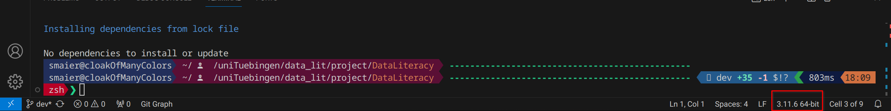
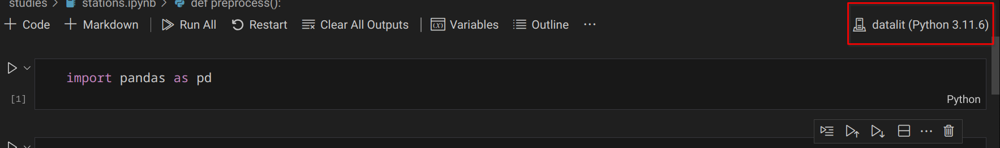

# DataLiteracy
Course content of Data-Literacy at university of Tübingen 

## Code Base

Note that you have manually create the database WeatherData in the mariadb docker

## Installation

We use `poetry` for package dependencies.
Poetry is (used here) in general similar to other project based package managers, eg. `npm`.

### Why poetry

The advantages of this approach over the approach of eg. raw `pip` with a `requirements.txt` is that it should be more repeatable:

* it keeps the precise package versions installed in a separate `poetry.lock` file and uses these versions, so version mismatch should be minimal
* it isolates you from the system packages (poetry creates a python `virtual environment` under the hood)
* this extends to many extra tools such as `jupyter`

### Installing `poetry`

Honestly they kind of messed up installation instructions since the last time I checked.

I simply use the system package on my system, however that version will be quite old for ubuntu (i checked with a docker image, it seems to be >2 years old at this point), which is the default WSL distribution.

Since `poetry` isnt that old to begin with I suspect that using such old a version isnt helpful.

So instead I suggest installing using the [official script](https://python-poetry.org/docs/#installing-with-the-official-installer).
[Wayback machine snapshot](https://web.archive.org/web/20231219164822/https://python-poetry.org/docs/#installing-with-the-official-installer) for reference, you can **ignore** the red warning, other than it states the guide is up to date, and you **ONLY** need to do the first step.

You should have `poetry` available as commandline argument afterwards (with a similar version):

```sh
> poetry --version
Poetry (version 1.7.1)
```

### Using `poetry`

With an installation of `poetry` you really only need to execute a single command in the project root (where the `pyproject.toml` is located):

```
poetry install --no-root
```

This will install all dependencies (with precisely the versions in the `poetry.lock` file, which is regenerated every time the dependencies are changed) into a virtual environment.

#### Using poetry with plain python files and VSCode

When using VSCode (with the Python and Jupyter extensions) and with a simple python file, this virtual environment can simply be selected by selecting the python version in the lower right corner while a python file is opened:



The virtual environment was automatically discovered for me, its recognizable by the (lowercase) name of the parent folder. Should this not work, with `poetry env info` you can see where the executable is located:

```sh
> poetry env info

Virtualenv
Python:         3.11.6
Implementation: CPython
Path:           /home/<user>/.cache/pypoetry/virtualenvs/dataliteracy-<id>-py3.11
Executable:     /home/<user>/.cache/pypoetry/virtualenvs/dataliteracy-<id>-py3.11/bin/python # <-- this is the path to select.
Valid:          True

System
Platform:   linux
OS:         posix
Python:     3.11.6
Path:       /usr
Executable: /usr/bin/python3.11
```

You can execute python files as normal.

Alternatively you can execute files with the commandline: `poetry run python whatever_file.py`.

#### Using Poetry with ipynb Files (Jupyter notebooks)

If you want to run the usual web interface of jupyter (google colab is based on that) you can use `poetry run jupyter notebook`, which will work just the same as `jupyter notebook` with a globally installed `jupyter`.

If instead you want to use VSCode, open that file, select the kernel (upper left corner):



Then select 'Select another kernel...', and then 'Python Environments...' and in there you should see the same virtual environment as before.

### Adding dependencies

Note that [dependencies](./pyproject.toml) are grouped. The default (`[tool.poetry.dependencies]`) and developer (`[tool.poetry.group.dev.dependencies]`) groups are installed by default.

You can search the PyPI repositories (the default for `pip`) with `poetry search <package>`, and add them the the default group with `poetry add <package_name>`.

Be sure to also commit the changes made the the [lockfile](./poetry.lock).

Other contributors will have to execute `poetry install --no-root` again afterwards.


## Data

In our project we will concentrate on approximatly 40 weather stations across the state of Baden-Württemberg.  
To download the historical data type:

```bash
python -m project get-recent --station-ids 4189 13965 755 757 5688 1197 1214 1224 1255 6258 1584 6259 2074 7331 2575 2814 259 3402 5562 6275 3734 1602 3925 3927 4160 4169 4300 4349 6262 4703 6263 5229 4094 5664 5731 --save-path data/dwd/recent/ --features precipitation air_temperature
```
